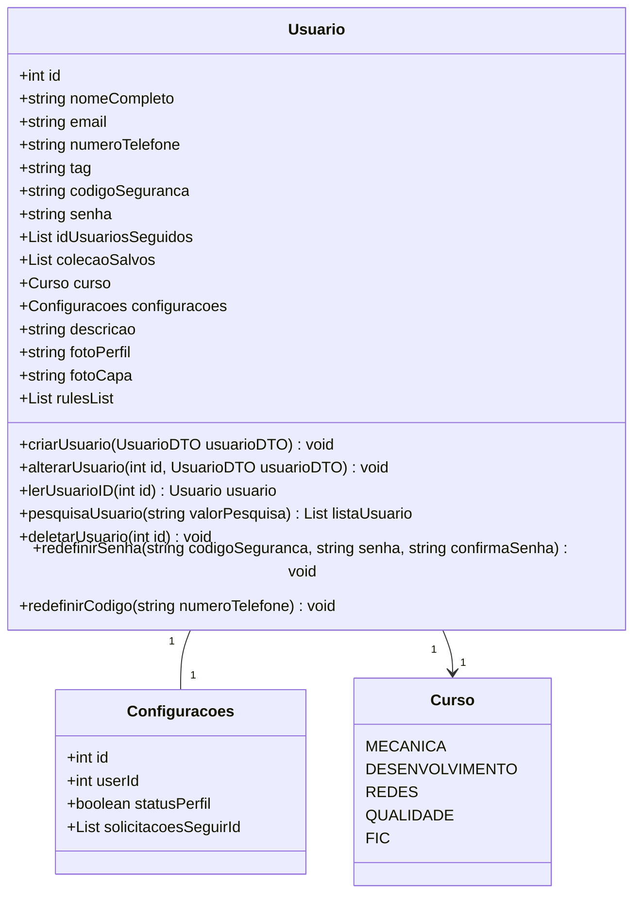

```mermaid
classDiagram
    class Usuario {
        +int id
        +string nomeCompleto
        +string email
        +string numeroTelefone
        +string tag
        +string codigoSeguranca
        +string senha
        +List<Integer> idUsuariosSeguidos
        +List<Integer> colecaoSalvos
        +Curso curso
        +Configuracoes configuracoes
        +string descricao
        +string fotoPerfil
        +string fotoCapa
        +List<string> rulesList
        +criarUsuario(UsuarioDTO usuarioDTO) void
        +alterarUsuario(int id, UsuarioDTO usuarioDTO) void
        +lerUsuarioID(int id) Usuario usuario
        +pesquisaUsuario(string valorPesquisa) List<Usuario> listaUsuario
        +deletarUsuario(int id) void
        +redefinirSenha(string codigoSeguranca, string senha, string confirmaSenha) void
        +redefinirCodigo(string numeroTelefone) void

    }

    class Configuracoes {
        +int id
        +int userId
        +boolean statusPerfil
        +List<Integer> solicitacoesSeguirId
    }

    class Curso {
        MECANICA
        DESENVOLVIMENTO
        REDES
        QUALIDADE
        FIC
    }

    Usuario "1"-- "1" Configuracoes
    Usuario "1"--> "1"Curso
```
